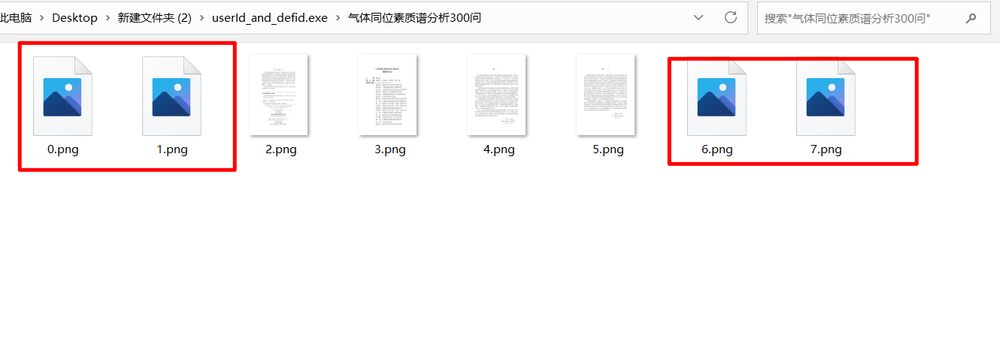
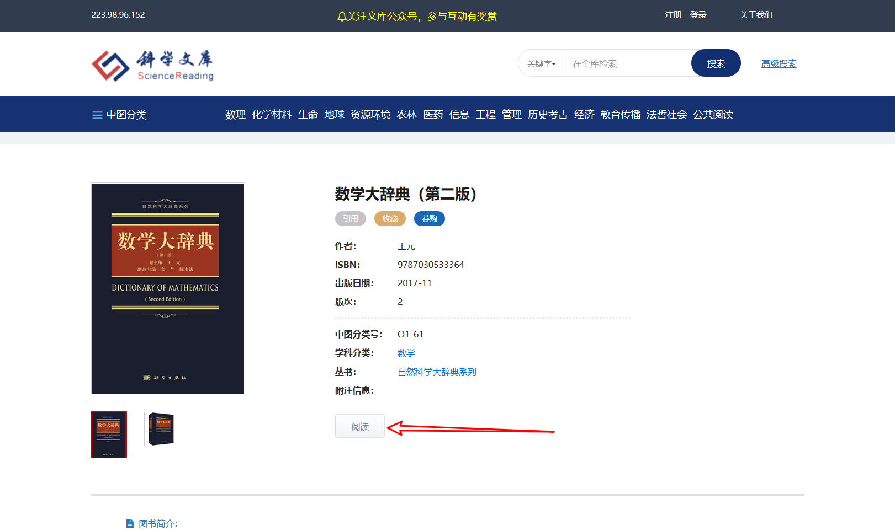

>网络上东拼西凑 俺不会python

# 前言：

程序的使用优先级 userId_and_defid > uuid_download > usecookie

>exe启动很慢。。。。。。 无内容显示时可以键入任意键 但不要按回车
>
>第一次启动exe可能会报错 
>
>也有可能会报毒。报毒原因不清。
>
>~~导入的目录标题分级可能会有错误，但是页码绝对正确，（完全正确的有空在搞）~~目录已分级
>
>如果网络正常 输入网址正确  可能是bug 也可能不可以下载了

可能出现的问题：

1. 下载的书籍如果同名，请将已下载的前一册文件夹删除或重命名，生成的pdf移走或重命名。

2. 如果使用uuid**闪退多次，请勿将浏览器查看uuid的界面关闭（可以关闭开发者工具）。

   1. 如果浏览器的阅读界面出现下图

      

      请刷新界面。（似乎当下载的页数与你浏览器中当前查看的页数相近时，下载的成功率会更高）

3. 重新下载不要慌，当全部文件正确下载，完成后就会退出。

4. 如果程序报错请留言（将测试 是否了可以解决，如无法解决，将告知）。

   

# 程序位置：

> 在相对应的文件夹下有exe文件可以运行, 最好为其新建快捷方式，放在易寻处。
>
> **userId_and_defid**
>
> 
>
> > 如果出现**userId_and_defid**无法下载并且访问书籍的阅读页面会出现下图情形。请使用**uuid_download**尝试
> >
> > 
>
> uuid_download
>
> 
>
> **usecookie**
>
> 
>
> 

# 下载书籍的位置

如果下载书籍图片一直失败（如图标红）可以等待程序继续运行，下载完成后会有失败的下载将会重下。

# 运行userId_and_bookdefid.exe准备环境

1. 科学文库书籍主页 （见最后的备注）

# 运行uuid_load.exe需要准备环境

1. 科学文库书籍主页（见最后的备注）
2. 书籍的uuid（见最后的备注）

>在下载过程中请不要关闭浏览器的阅读页面 
>
>>
>>
>>

# 运行usecookie.exe需要准备环境

1. 安装火狐浏览器 并且安装位置为C:\Program Files\Mozilla Firefox

2. geckodriver.exe 位置放在火狐浏览器的安装位置（C:\Program Files\Mozilla Firefox\geckodriver.exe）网盘文件夹firefox下有geckodriver.exe压缩包

3. 调用火狐浏览器时，会运行火狐浏览器，访问下载书籍的阅读页面获取用户cookie切勿关闭！

4. 运行：1. 点击运行；2.在程序所在文件夹显示路径键入cmd回车，跳出cmd终端 。在终端，输入程序首字母，按table键。（回车运行）

   >
   >
   >
   >
   >

# ~~运行notUsecookieMain.exe准备环境：~~

1. ~~运行即可~~
2. ~~运行：1. 点击运行；2.在程序所在文件夹显示路径键入cmd回车，跳出cmd终端 。在终端，输入程序首字母，按table键。（回车运行）~~

~~**但是用户cookie很快就会过期，可能无法运行** （四月份初过期）~~

# py代码

## 准备环境

> cookie因该是cookie.js生成  但是不懂啊不懂，不会啊不会。不用浏览器类浏览器，可以用其他方式获取吗

>使用的库有
>
>import os
>
>import wget,os,random
>from time import sleep
>
>from time import time
>from selenium import webdriver
>import pickle
>
>import urllib.request
>from bs4 import BeautifulSoup
>import requests
>import jsonsearch
>import json
>import sys
>
>import re
>
>from PyPDF2 import PdfFileReader as pdf_read, PdfFileWriter as pdf_write

- python main.py

# 运行页面

- 输入书籍主页 回车

- 开始响应

# 备注：

## 书籍的网址，书籍主页类似于下图

## 如何查看uuid

打开书籍所在页面->阅读->F12->筛选uuid（如果出现下图所示，先点确定等待一会儿 ）

## 操作步骤截图：

- ### 书籍的主页面点击阅读

- ### 此页面按F12 

- ### 点击网络 输入框中的文字 ’uuid‘。

- 点击

  - ’ 您当前打开的图书，文件较大，加载期间许哟啊您等待一会‘ 的’确认按钮‘

- 等待

- ### 等待加载完成页面 

- ### 可以看到筛选出的uuid

- ### 左击，复制uuid

## 重新获取cookie：

需要安装火狐浏览器（因为代码使用了火狐浏览器）

安装位置为默认安装位置 有关代码在py目录下的default_userCookieVal.py第30行 ，geckodriver.exe 在firefox文件夹下