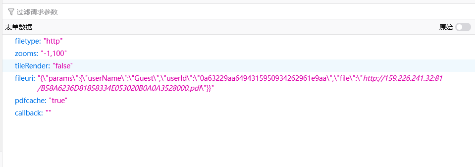
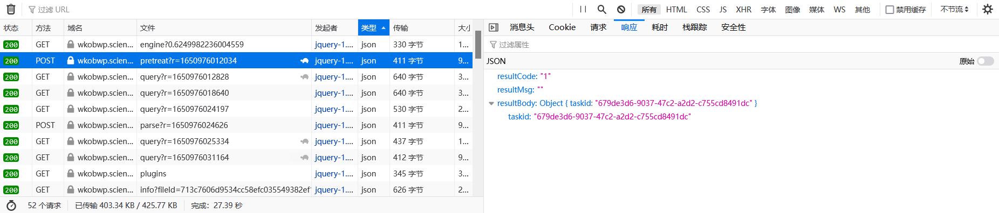

# 科学文库下载搞事情目录

| 序号 | 搞事情             | 是否打算尝试 | 时间          | 更新时间      | 备注             | 拖延症 |
| ---- | ------------------ | ------------ | ------------- | ------------- | ---------------- | ------ |
| 1    | 多线程下载         | 是           | 2022年4月26日 |               | 是否被阻断下载？ |        |
| 2    | UI化               | 有点不确定   | 2022年4月26日 |               |                  |        |
| 3    | 将UserId和Uuid合并 | 是           | 2022年4月26日 | 2022年4月26日 |                  |        |
| 4    |                    |              |               |               |                  |        |

## 多线程下载

## UI化

## 将UserId和Uuid 合并

### 实现方式

当文件过大时UserId的result:OutOfFileSizeLimit

然后转到Uuid

输入Uuid

### Uuid获取方式

最终获取的uuid

https://wkobwp.sciencereading.cn/api/v2/task/dabb2363-e97c-43f1-a797-aed26d3d549c/query

https://wkobwp.sciencereading.cn/api/v2/task/<font color='red'>taskid</font>/query

```
{"resultCode":"0",
"resultMsg":"",
"resultBody":{
	"docid":"a-0$e65064cb-a54f-4a03-849c-2a96a33ad0f3",
	"result":"0",
	"md5":"1e6deb3a42eca7a75341eb0919cc23c9",
	"uuid":"713c7606d9534cc58efc035549382ef1",
	"size":"1089518057"
	}
}
```


#### 需要依赖获取takeid

用于获取dabb2363-e97c-43f1-a797-aed26d3d549c（<font color='red'>taskid</font>）

```
curl "https://wkobwp.sciencereading.cn/spi/v2/doc/pretreat?r=1650974861150" -X POST -H "User-Agent: Mozilla/5.0 (Windows NT 10.0; Win64; x64; rv:99.0) Gecko/20100101 Firefox/99.0" -H "Accept: */*" -H "Accept-Language: zh-CN,zh;q=0.8,zh-TW;q=0.7,zh-HK;q=0.5,en-US;q=0.3,en;q=0.2" -H "Accept-Encoding: gzip, deflate, br" -H "Content-Type: application/x-www-form-urlencoded; charset=UTF-8" -H "accessToken: accessToken" -H "Origin: https://book.sciencereading.cn" -H "Connection: keep-alive" -H "Referer: https://book.sciencereading.cn/" -H "Sec-Fetch-Dest: empty" -H "Sec-Fetch-Mode: cors" -H "Sec-Fetch-Site: same-site" --data-raw "filetype=http&zooms=-1"%"2C100&tileRender=false&fileuri="%"7B"%"22params"%"22"%"3A"%"7B"%"22userName"%"22"%"3A"%"22Guest"%"22"%"2C"%"22userId"%"22"%"3A"%"220a63229aa6494315950934262961e9aa"%"22"%"2C"%"22file"%"22"%"3A"%"22http"%"3A"%"2F"%"2F159.226.241.32"%"3A81"%"2FB58A6236D81858334E053020B0A0A3528000.pdf"%"22"%"7D"%"7D&pdfcache=true&callback="
```

请求：



响应：



#### 需要依赖file

输入的书籍地址（截取 id=）

https://book.sciencereading.cn/shop/book/Booksimple/show.do?id=B58A6236D81858334E053020B0A0A3528000


### **总结：**

1. 输入的书籍主页拼接<font color='red'>file</font>的链接
2. 伪造请求访问https://wkobwp.sciencereading.cn/spi/v2/doc/pretreat获取<font color='red'>takeid</font>
3. 伪造请求访问https://wkobwp.sciencereading.cn/api/v2/task/{takeid}/query 获取uuid